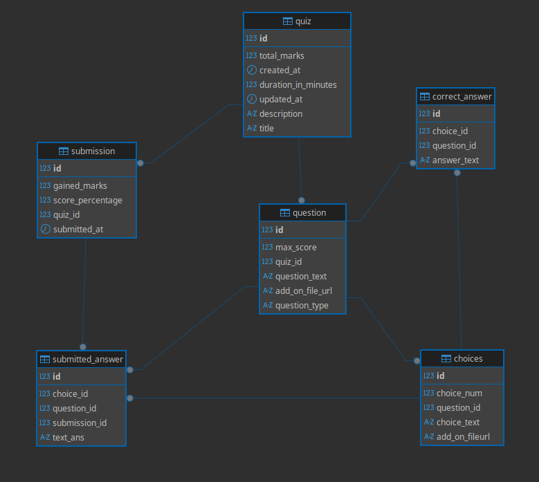

> **Note:** Unit testing is done manually and no Test cases are written yet
# Online Quiz API
A RESTful API designed to handle quiz creation, question management, and quiz delivery.

-----
## Functional Requirements

### 📘 Quiz Management

- Full **CRUD operations** for quizzes (Create, Read, Update, Delete).
- Ability to manage questions within a quiz, including:
    - Defining question text.
    - Adding multiple choices.
    - Marking correct answers.
- Support for **multiple question types**:
    - **Multiple Choice Questions (MCQs)**:
        - Single-select
        - Multi-select
    - **Text-based Answers** (subjective)

---

### ‍💻 Quiz Participation (Taking a Quiz)

- Users can retrieve a quiz along with all its questions and available answer options.
- Users can submit their answers for a given quiz.
- Upon submission:
    - The system immediately calculates and returns a **score** for MCQ-type questions.
    - **Text-based answers** are excluded from automatic scoring and must be evaluated manually by the quiz creator (or admin).

### 🛠️ Technology Stack Used

- **Java** - Programming language
- **Spring Boot** - Backend framework
- **PostgreSQL** - Relational database
- **Spring Data JPA** - ORM for database interaction
- **Docker** - Containerization
- **Docker Compose** - Multi-container orchestration

### Database Schema Design

    
### Defined Endpoints and API Contracts
- POST ```/api/quizzes/manage```                
  - **Description**: To Create new Quiz with title and description 
  - **Request Body:**
  ```JSON
    {
        "title": "First quiz",
        "description": "First description",
        "durationInMinutes": "60",
        "totalMarks": "400"
    }
  ```
    - **Response Body:**
  ```JSON
    {
        "id": 3,
        "title": "First quiz",
        "description": "First description",
        "createdAt": "2025-10-07T05:26:54.772781",
        "updatedAt": "2025-10-07T05:26:54.772837",
        "durationInMinutes": 60,
        "totalMarks": 400
    }
    ```

- PATCH ```/api/quizzes/manage```                
  - **Description**: To update details of created quiz 
  - **Request Body:**
  ```JSON
    {
      "description": "First yyydescriptio1231n",
      "durationInMinutes": 160,
      "totalMarks": "402"
    }
  ```
    - **Response Body:**
  ```JSON
    {
       "id": 3,
       "title": "First quiz",
       "description": "First yyydescriptio1231n",
       "createdAt": "2025-10-07T05:26:54.772781",
       "updatedAt": "2025-10-07T05:26:58.88979",
       "durationInMinutes": 160,
       "totalMarks": 402
    }
    ```
- POST ```/api/quizzes/manage/questions/{id}```
  - **Description**: To Create and add questions to quiz
  - **Request Body:**
  ```JSON
    {
      "questionText": "Question 1",
      "addOnFileUrl": "",
      "maxScore": "100",
      "questionType": "BINARY",
      "choices": [
        {
           "choiceNum": 1,
            "choiceText": "True"
        },
        { 
          "choiceNum": 2,
          "choiceText": "False" 
        }
      ],
      "correctAnswers": {
        "correctChoicesNum": [1]
      }
    }
  ```
  - **Response Body:**
  ```json
    {
      "id": 4,
      "questionText": "Question 1",
      "addOnFileUrl": "",
      "maxScore": null,
      "questionType": "BINARY",
      "quizId": null,
      "choices": [
          {
              "id": 7,
              "choiceNum": 1,
              "choiceText": "True",
              "addOnFileURL": null
          },
          {
              "id": 8,
              "choiceNum": 2,
              "choiceText": "False",
              "addOnFileURL": null
          }
      ],
      "correctAnswers": {
          "correctAnswerText": null,
          "correctChoiceNum": [
              1
          ]
      }
    }
  ```

- GET ```/api/quizzes/take/{id}```        
  - **Description**:To fetch Quiz by Id
  - **Response Body**
  ```JSON
    {
      "id": 2,
      "title": "First quiz",
      "description": "First description",
      "updatedAt": "2025-10-07T05:26:53.506416",
      "durationInMinutes": 60,
      "totalMarks": 400.00,
      "questions": [
          {
            "id": 1,
            "questionText": "Question 1",
            "addOnFileUrl": "",
            "maxScore": 100.00,
            "questionType": "BINARY",
            "choices": [
                {
                    "id": 1,
                    "choiceText": "True",
                    "addOnFileURL": null
                },
                {
                    "id": 2,
                    "choiceText": "False",
                    "addOnFileURL": null
                }
            ]
        }
      ]
    }
    ```
- POST ```/api/quizzes/take```       
  - **Description** : To submit Quiz Answer
  - **Request Body**
  ```json
    {
    "quizId": 2,
    "questionAnswerList": [
        {
            "questionId" : 1,
            "selectedChoiceIds": [1]
        },
        {
            "questionId" : 2,
            "selectedChoiceIds": [3]
        },
        {
            "questionId" : 3,
            "selectedChoiceIds": [5]
        } 
      ]
    }
  ```
  - **Response Body**
  ```json
    {
       "gainedScore": 300.0,
       "totalScore": 400.0
    }
  ```